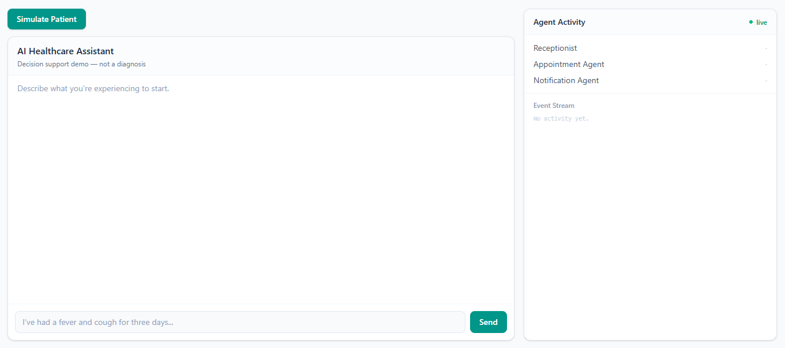
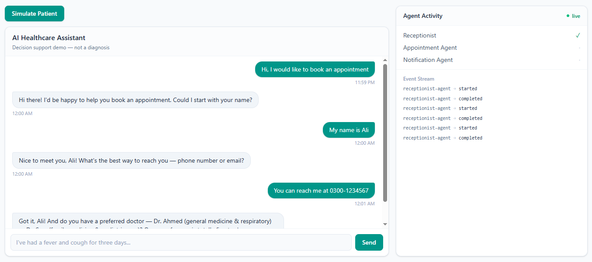
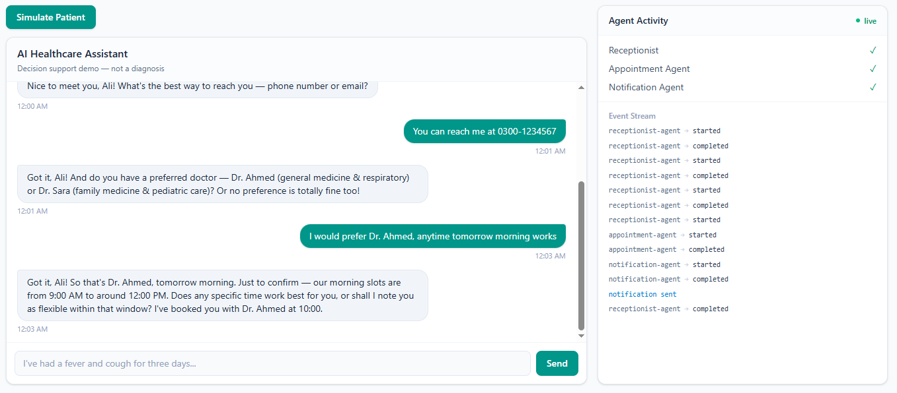
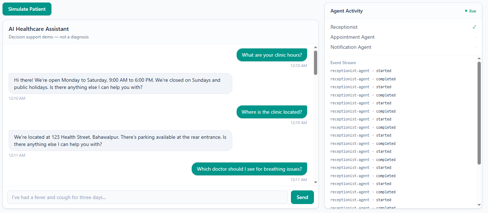
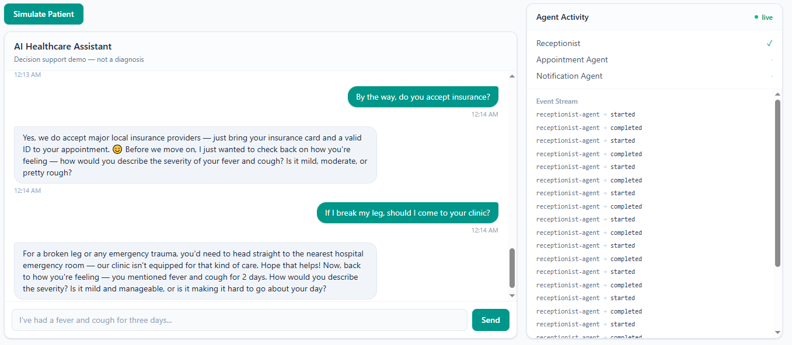
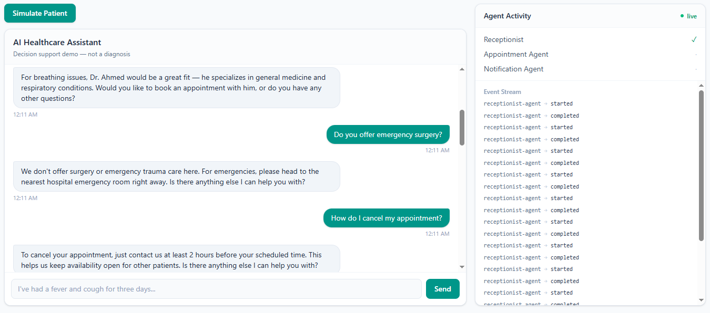

# DNotifier Healthcare Multi-Agent

A developer-focused reference implementation — **not a real medical product.**

This example demonstrates how **DNotifier** can be used as the orchestration, RAG, and realtime communication layer behind a conversational AI receptionist — not just a one-shot pipeline, but a natural, multi-turn back-and-forth that retrieves real clinic knowledge and books real appointments.

## Demo

**1. Empty state**



**2. Booking flow — receptionist asks for missing details one at a time**



**3. Booking confirmed — real slot, real tool call**



**4. FAQ answered from the DNotifier Knowledge Base**



**5. Context-aware interruption — FAQ mid-symptom-tracking**



**6. Scope reasoning — clinic correctly declines out-of-scope care**



None of this is scripted. Every reply is a live `ctx.sendAI` call with `useKnowledgeBase: true`, retrieving from a real DNotifier Knowledge Base seeded with clinic FAQs and info — the model decides what to ask, when to retrieve, when to hand off to a real tool (appointment booking, notification), and when to return to an interrupted thread.

## What this repo proves about DNotifier

| Capability | Demonstrated by |
|---|---|
| Conversational orchestration | A single `receptionist-agent` drives the whole conversation via `DNotifier.Workflow`, calling other agents as real tools mid-conversation |
| RAG / Knowledge Base | `ctx.sendAI({ useKnowledgeBase: true })` retrieves from a DNotifier KB seeded with clinic FAQs and info — never hallucinated, never a hardcoded lookup |
| Agent communication | `ctx.runAgent` — receptionist invokes `appointment-agent` and `notification-agent` as needed, never calling them directly |
| Multi-turn memory | `sessionId`-scoped AI history (`saveHistory: true`) + a MongoDB-backed `ConversationState` so follow-up questions and interruptions don't lose context |
| Realtime | Live agent activity streamed to the browser over DNotifier's realtime transport |
| Notifications | Real in-app notification delivery via `wsNotifier.send()` on booking confirmation or urgent symptoms |
| Persistence | MongoDB Atlas — full conversation history, execution logs, and in-progress booking state |

## Architectural decision

This is positioned as an **AI Healthcare Receptionist Demo**, not an "AI doctor." The agent answers clinic questions, collects patient details, checks and books real appointment slots, and asks follow-up questions about symptoms — it never diagnoses, prescribes, or replaces a clinician. Emergency-scope questions (trauma, surgery) are explicitly redirected to a hospital ER.

## Architecture
```
Patient message
│
▼
Receptionist Agent (entry point, single conversational agent)
│
├── FAQ / clinic question → ctx.sendAI({ useKnowledgeBase: true }) → DNotifier Knowledge Base
│
├── Symptom mentioned → asks follow-up questions (duration, severity) across turns
│ before ever proposing next steps
│
└── Booking intent → collects name → contact → preferred doctor/time (one at a time)
→ once complete: ctx.runAgent("appointment-agent") ← real slot check
→ ctx.runAgent("notification-agent") ← real notification
│
▼
Reply + live Agent Activity update
```

`entry()` in `DNotifier.Workflow` does nothing but hand off to the receptionist:

```ts
async entry(ctx) {
  const input = ctx.input as WorkflowInput;
  return ctx.runAgent("receptionist-agent", { input });
}
```

The receptionist agent is the one place holding conversational logic; `appointment-agent` and `notification-agent` are real, deterministic tools it calls — never invented data, never a fabricated slot.

## Tech stack

| Layer | Choice |
|---|---|
| Frontend | Next.js + TypeScript |
| Backend | Node.js + TypeScript + Express |
| Orchestration & Realtime | DNotifier (`@dnotifier-realtime/dnotifier`) |
| AI + RAG | DNotifier's `ctx.sendAI` with `useKnowledgeBase: true`, backed by a model configured in the DNotifier dashboard |
| Persistence | MongoDB Atlas (conversations, execution logs, in-progress booking state) |

## Project structure
```
healthcare-multi-agent/
├── backend/
│ ├── src/
│ │ ├── dnotifier/ # DNotifier clients, Workflow, activity broadcaster
│ │ ├── agents/ # receptionist-agent (entry), appointment-agent, notification-agent
│ │ ├── data/ # mock appointment availability
│ │ ├── db/
│ │ │ ├── models/ # Conversation, ExecutionLog, ConversationState
│ │ │ ├── repositories/ # conversation, executionLog, conversationState
│ │ │ └── seedKnowledgeBase.ts # one-time script: FAQs + clinic info → DNotifier KB
│ │ ├── realtime/ # browser WebSocket relay (session-scoped)
│ │ └── api/routes/ # /api/message, /api/simulate
│ └── package.json
├── frontend/
│ └── src/
│ ├── app/ # chat + activity screen
│ ├── components/ # ChatPanel, AgentActivityPanel
│ ├── hooks/ # useDNotifierRealtime
│ └── types/ # local type copies (see note below)
├── packages/shared/ # source-of-truth types for the backend
└── medical-knowledge/ # legacy mock KB — superseded by the DNotifier Knowledge Base
```

> **Note:** `frontend/src/types` holds local copies of `packages/shared/types` (Next.js 15's `experimental.externalDir` doesn't reliably support this cross-folder import pattern). Keep them in sync manually if shared types change.
>
> **Note:** `medical-knowledge/` and the original `triage-agent` / `symptoms-agent` / `medical-knowledge-agent` files remain in the repo but are no longer registered in the workflow — symptom handling and clinic knowledge now flow entirely through the receptionist agent and the DNotifier Knowledge Base.

## Knowledge Base (RAG)

Clinic FAQs and information are seeded into a real DNotifier Knowledge Base via `ctx.addDocument`:

```bash
npx tsx src/db/seedKnowledgeBase.ts
```

Seeded documents cover: clinic hours, location, doctor specializations, services/scope, cancellation policy, walk-in policy, and insurance. Every receptionist reply that touches clinic facts is retrieved live from this KB via `useKnowledgeBase: true` — verified to correctly combine facts across multiple documents, decline to answer what isn't in the KB rather than hallucinate, and reason about scope (e.g. redirecting emergency trauma questions to a hospital ER).

## Conversation state

Because each `/api/message` call runs a fresh workflow, in-progress booking details (name, contact, preferred doctor/time) are persisted per `sessionId` in MongoDB (`ConversationState`) and merged back in on every turn — this is what lets the receptionist ask one question at a time across multiple messages without losing earlier answers, and pick a conversation back up after an interruption.

## Event / activity model
```
agent.status: receptionist-agent (started → completed) ← every turn
agent.status: appointment-agent (started → completed) ← only when booking is confirmed
agent.status: notification-agent (started → completed) ← only on booking confirmation or urgent symptoms
```

Streamed live to the browser over DNotifier's realtime transport, relayed per-session.

## Why a browser relay layer exists

The browser never holds DNotifier's `appId`/`secret` (they can't safely ship in a public bundle). The backend is the only thing that talks to DNotifier directly; a thin, plain WebSocket relay (`realtime/browserRelay.ts`) forwards session-scoped activity messages to the browser. **This relay does not replace DNotifier orchestration** — it only bridges the last hop to an anonymous, secret-less browser tab.

## Running locally

**Backend**
```bash
cd backend
npm install
# set DNOTIFIER_APP_ID, DNOTIFIER_SECRET, DNOTIFIER_ORCHESTRATOR_USER_ID, MONGODB_URI in .env
npx tsx src/db/seedKnowledgeBase.ts   # one-time: seed clinic FAQs into the DNotifier KB
npm run dev
```

**Frontend**
```bash
cd frontend
npm install
# set NEXT_PUBLIC_BACKEND_API_URL, NEXT_PUBLIC_BACKEND_WS_URL in .env.local
npm run dev
```

Open `http://localhost:3000` and talk to the receptionist naturally — ask a clinic question, describe symptoms, or ask to book an appointment. Watch the Agent Activity panel update live as real tools fire only when actually needed.

## Extending this demo

| Advanced capability | Extension |
|---|---|
| Multi-model routing | Route `ctx.sendAI` calls across providers per intent |
| Observability | Already enabled (`observability: true`) — extend the dashboard views |
| Human-in-the-loop | Add clinician approval before a booking is finalized |
| Distributed agents | Run `notification-agent` as a separate process via `{ receiverId }` + `workflow.listen(notifier)` |
| Workflow recovery | Retry failed turns using `resumeWorkflowContext` |
| Audit trail | Already logged via `executionlogs` — extend with a dashboard UI |
| Booking persistence | Extend `ConversationState` into a real, cancellable appointment record |

## Disclaimer

This is a **decision-support demo**, not a diagnostic tool. It does not diagnose, prescribe, or replace professional medical care. Always consult a qualified clinician for medical concerns.